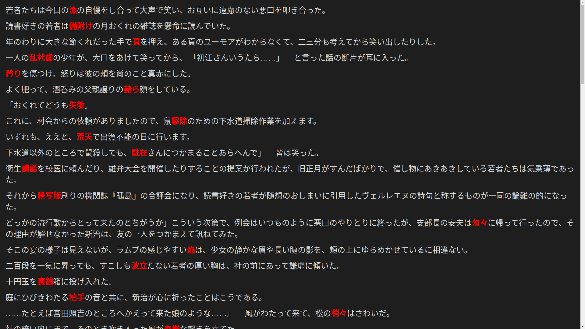

# ann2html
## Description
A small program that uses Kindle's vocabulary builder and turns it into a usable HTML page.



## Features
* Single executable, easy to install 
* Pressing b on the page will bookmark your current position.
* The template file's css and javascript can be easily modified.
* Automatically bolds selected word from Vocabulary builder(It will fail if vocabulary builder deconjugates the selected word)

## Installation
Download your operating system specific release and make a folder in their appropriate location and move your files to it.
| Windows | Linux | Mac |
| --------------- | --------------- | --------------- |
| %appdata%\ann2html | $HOME/.config/ann2html |$HOME/Library/Application Support/ann2html  |
Then either edit the line in the config file to point to your kindles vocab.db or copy your kindle's vocab.db in to ann2html's folder.

### Linux script
For linux users there is an optional script called ann which allows easy mounting of your kindle. To use the script add your uuid to it,make it executable and add it to your path.This script does depend on udisksctl so make sure to install it.

To find your uuid run ```ls -l /dev/disk/by-uuid``` and then connect your kindle and run it again.
```
ls -l /dev/disk/by-uuid
total 0
lrwxrwxrwx 1 root root 10 Nov 10 00:00 3472-5482 -> ../../nvme
lrwxrwxrwx 1 root root 10 Nov 10 00:00 3472-54821212 -> ../../nvme2
PLUG IN KINDLE AND RUN AGAIN
ls -l /dev/disk/by-uuid
total 0
lrwxrwxrwx 1 root root 10 Nov 10 00:00 3472-5482 -> ../../nvme
lrwxrwxrwx 1 root root 10 Nov 10 00:00 3251-54821212 -> ../../nvme2
lrwxrwxrwx 1 root root 10 Nov 10 00:00 3582-6578 -> ../../sda
in this example the UUID you want is 3582-6578 
```
Then in the script called ann add your kindle uuid to the following line.
```
kindle_UUID=
```
```
kindle_UUID=3582-6578
```
Then run chmod +x ann
and then move ann anywhere in your path, now you can just run ann and your kindle will be mounted and ann2html will be ran!


## Usage


After setting it up, you just connect your kindle, run ann and it will update your output file with the newest annotations.

## Configuration
The program can be configured in two ways, by directly editing the configuration file or setting the environmental variable(env variable takes priority)
### Default configuration location


| Option | default value | explanation |
| --------------- | --------------- | --------------- |
| ANN2HTML_CONFIG |NOTSET | env variable to change the location of your config file. |
| ANN2HTML_VOCABDB | vocab.db | location of your vocab.db.  |
| ANN2HTML_NUM | 0 | unix timestamp of the last annotation, this is changed by the program.|
| ANN2HTML_TEMPLATE | template.html | File to use as a template for your output file.|
| ANN2HTML_OUTPUT | edit.html | where you want your annotation to be written, this file will be replaced on each run. |
| ANN2HTML_LNG| ja | list of languages you want to get annotations from, split by , example:ja,en|


